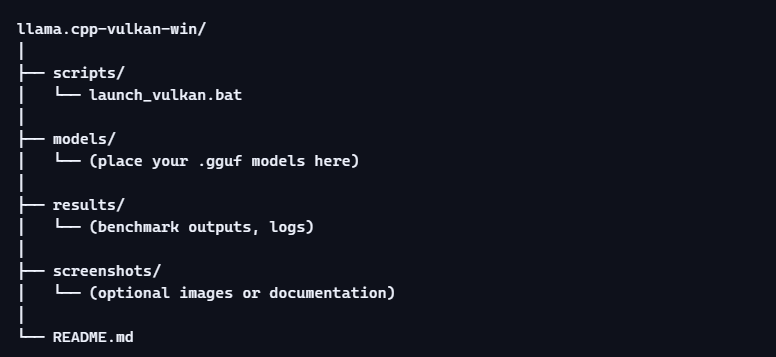
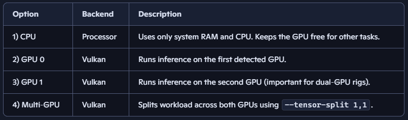

# llama.cpp Vulkan – Windows Build for Dual RX 580

This repository provides a Windows‑ready Vulkan build of llama.cpp, optimized for systems equipped with dual AMD RX 580 GPUs.
It includes a fully interactive menu‑driven .bat launcher that transforms the command‑line tool into a simple, user‑friendly interface.

The goal is to offer a plug‑and‑play experience: download, place your models, run the launcher, and choose how you want to use your hardware.

## 🚀 Features of the Launcher Script
1. Preparation and Relative Paths
The script automatically configures the working environment:

Uses %~dp0 to ensure full portability.
You can move the folder anywhere and the script will still work.

Automatically creates the models/ folder if missing.
This guides the user on where to place .gguf files.

2. Automatic Model Selection
No need to type filenames manually.

Scans the models/ directory for all .gguf files

Displays them in a numbered menu

The user simply enters the number of the desired model

The script stores the full path automatically

This eliminates typos and speeds up workflow.

3. Intelligent Hardware Management (Vulkan)
The launcher offers four execution modes, ideal for dual‑GPU setups:

The multi‑GPU mode provides the highest performance on RX 580 pairs.

4. Default Configuration Parameters
The script sets safe and efficient defaults:

CTX = 4096  
Defines the maximum context length for conversation memory.

THREADS = 8  
Optimizes CPU usage during computation.

Network server on port 11434  
Compatible with tools like Ollama, accessible locally or over LAN.

These values can be modified directly inside the script if needed.

5. Launch and Execution
After selecting:

the model

the backend

the hardware mode

…the script builds the final command and runs llama.cpp.

A summary is displayed before execution, confirming:

selected model

active backend

GPU or CPU mode

tensor split (if multi‑GPU)

This ensures the user always knows exactly what is running.

## 📦 Releases
Precompiled binaries for Windows (Vulkan build) are available in the Releases section.
You can download:

the launcher script

the Vulkan-enabled llama.cpp executable

optional benchmark results

This allows users to run the project without compiling anything.

## 🧩 Requirements
Windows 10/11

AMD GPUs with Vulkan support (RX 580 recommended)

Latest AMD drivers

.gguf model files placed in the models/ folder

## 📝 Notes
This project is intended for local inference and experimentation.

No proprietary models are included.

Users must provide their own .gguf models.

## 🤝 Contributions
Pull requests, improvements, and optimizations are welcome — especially regarding:

Vulkan performance

Multi‑GPU tuning

Script enhancements

Documentation

📄 License
Choose the license that best fits your needs (MIT recommended for open use).
